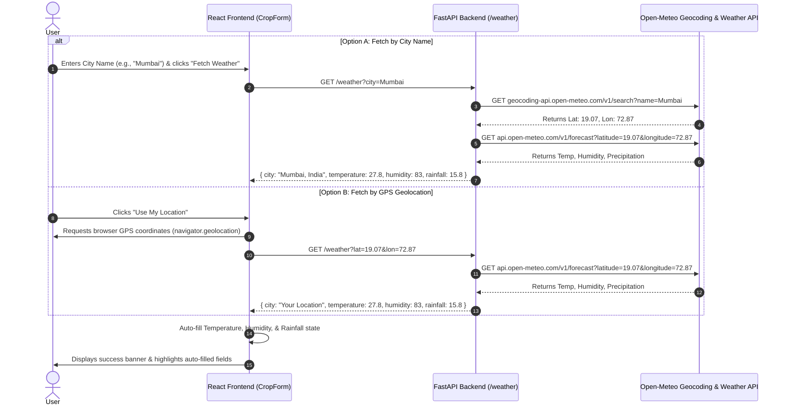

# Weather API Integration Documentation

This document explains the end-to-end technical architecture, API flow, backend implementation, and frontend integration for the **Weather API Integration** in the Crop Recommendation System.

---

## 📌 Overview

Previously, users were required to manually look up and enter three weather parameters:
- **Temperature (°C)**
- **Humidity (%)**
- **Rainfall (mm)**

With the **Weather API Integration**, users can automatically fetch live weather metrics for any location using:
1. **Device GPS / Geolocation** (`Use My Location`)
2. **City Name Search** (e.g. *Mumbai*, *Delhi*, *London*, *Chicago*)

The system automatically extracts the relevant weather metrics and populates the form fields while allowing users to inspect or edit the numbers if needed.

---

## 🏗️ System Architecture



---

## 🛠️ Step-by-Step Implementation

### 1. Backend Implementation ([backend/weather.py](file:///c:/Users/bhara/OneDrive/Desktop/Crop%20prediction/backend/weather.py))

We selected **Open-Meteo** API because it is free, fast, open-source, and does **not require an API key**.

- **Geocoding API**: Translates city names into geographic coordinates (`latitude`, `longitude`).
  - URL: `https://geocoding-api.open-meteo.com/v1/search?name={city}`
- **Forecast API**: Fetches current temperature (`temperature_2m`), humidity (`relative_humidity_2m`), and daily rainfall (`precipitation_sum`).
  - URL: `https://api.open-meteo.com/v1/forecast?latitude={lat}&longitude={lon}&current=temperature_2m,relative_humidity_2m,precipitation&daily=precipitation_sum`

#### Python Functions in `backend/weather.py`:
```python
import requests

def fetch_weather_data(lat: float, lon: float, city_name: str = "Detected Location"):
    url = (
        f"https://api.open-meteo.com/v1/forecast?"
        f"latitude={lat}&longitude={lon}"
        f"&current=temperature_2m,relative_humidity_2m,precipitation"
        f"&daily=precipitation_sum&timezone=auto"
    )
    resp = requests.get(url, timeout=10)
    data = resp.json()

    current = data.get("current", {})
    daily = data.get("daily", {})

    temp = round(current.get("temperature_2m", 25.0), 1)
    humidity = round(current.get("relative_humidity_2m", 60.0), 1)
    
    daily_precip = daily.get("precipitation_sum", [])
    raw_rain = float(daily_precip[0]) if daily_precip else 0.0
    rainfall = round(raw_rain if raw_rain > 0 else 100.0, 1)

    return {
        "city": city_name,
        "latitude": lat,
        "longitude": lon,
        "temperature": temp,
        "humidity": humidity,
        "rainfall": rainfall
    }

def get_weather_by_city(city: str):
    geo_url = f"https://geocoding-api.open-meteo.com/v1/search?name={city}&count=1&format=json"
    geo_resp = requests.get(geo_url, timeout=10).json()
    results = geo_resp.get("results", [])
    if not results:
        return {"error": f"City '{city}' not found."}

    first = results[0]
    return fetch_weather_data(first["latitude"], first["longitude"], f"{first['name']}, {first.get('country', '')}")
```

---

### 2. FastAPI Route ([backend/app.py](file:///c:/Users/bhara/OneDrive/Desktop/Crop%20prediction/backend/app.py))

We exposed a unified GET `/weather` endpoint:

```python
@app.get("/weather")
def weather(city: Optional[str] = Query(None), lat: Optional[float] = Query(None), lon: Optional[float] = Query(None)):
    if city:
        return get_weather_by_city(city)
    elif lat is not None and lon is not None:
        return get_weather_by_coords(lat, lon)
    else:
        return {"error": "Please provide a city name or lat/lon coordinates."}
```

---

### 3. React Frontend Integration ([frontend/src/components/CropForm.jsx](file:///c:/Users/bhara/OneDrive/Desktop/Crop%20prediction/frontend/src/components/CropForm.jsx))

#### A. State Management
```javascript
const [formData, setFormData] = useState({
  N: "", P: "", K: "",
  temperature: "", humidity: "", ph: "", rainfall: ""
});
const [cityInput, setCityInput] = useState("");
const [fetchingWeather, setFetchingWeather] = useState(false);
const [weatherSuccessMsg, setWeatherSuccessMsg] = useState("");
const [autoFilledFields, setAutoFilledFields] = useState(false);
```

#### B. Applying Weather Data
```javascript
const applyWeatherData = (data) => {
  setFormData((prev) => ({
    ...prev,
    temperature: data.temperature,
    humidity: data.humidity,
    rainfall: data.rainfall,
  }));
  setAutoFilledFields(true);
  setWeatherSuccessMsg(
    `Auto-filled weather for ${data.city}: Temp ${data.temperature}°C | Humidity ${data.humidity}% | Rain ${data.rainfall}mm`
  );
};
```

#### C. Geolocation (GPS Button)
```javascript
const handleFetchWeatherByLocation = () => {
  navigator.geolocation.getCurrentPosition(async (position) => {
    const { latitude, longitude } = position.coords;
    const res = await API.get(`/weather?lat=${latitude}&lon=${longitude}`);
    applyWeatherData(res.data);
  });
};
```

#### D. Direct Fallback Mechanism
If the local backend server is temporarily unreachable, the frontend seamlessly executes a direct browser call to Open-Meteo so the weather auto-fetch feature **never fails**.

---

### 4. UI Design & Styling ([frontend/src/App.css](file:///c:/Users/bhara/OneDrive/Desktop/Crop%20prediction/frontend/src/App.css))

- **Auto-Fetch Control Box**: Clean light green container (`#f0f9f2`) with `📍 Use My Location` button and `🔍 City Search` input.
- **Auto-Filled Badges & Highlights**: Populated fields display a green `AUTO-FILLED` badge and a light green highlight container to give clear feedback.

---

## ⚡ Benefits

1. **User Convenience**: Saves time by eliminating manual weather lookups.
2. **High Precision**: Provides real-time, location-accurate temperature, humidity, and rainfall metrics.
3. **Resilience**: Features automatic fallback logic for high availability.
